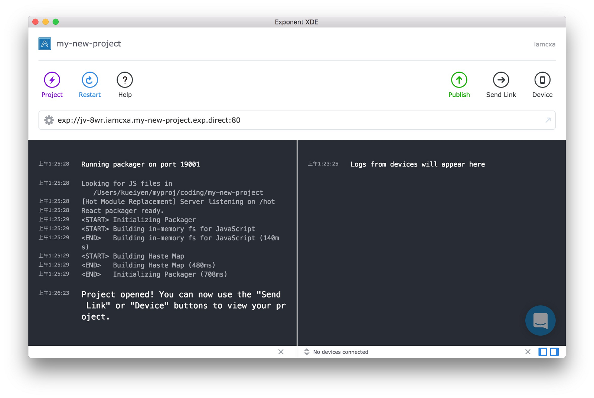
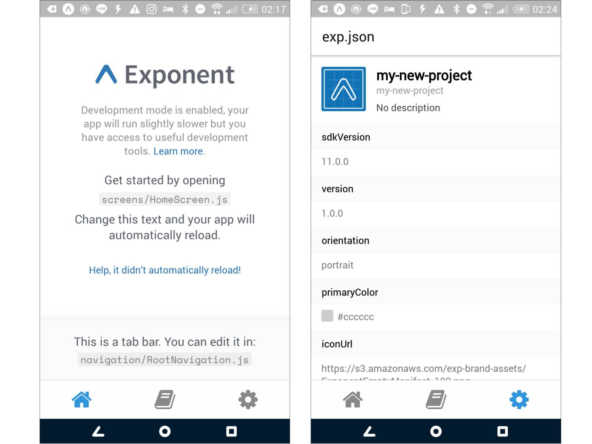
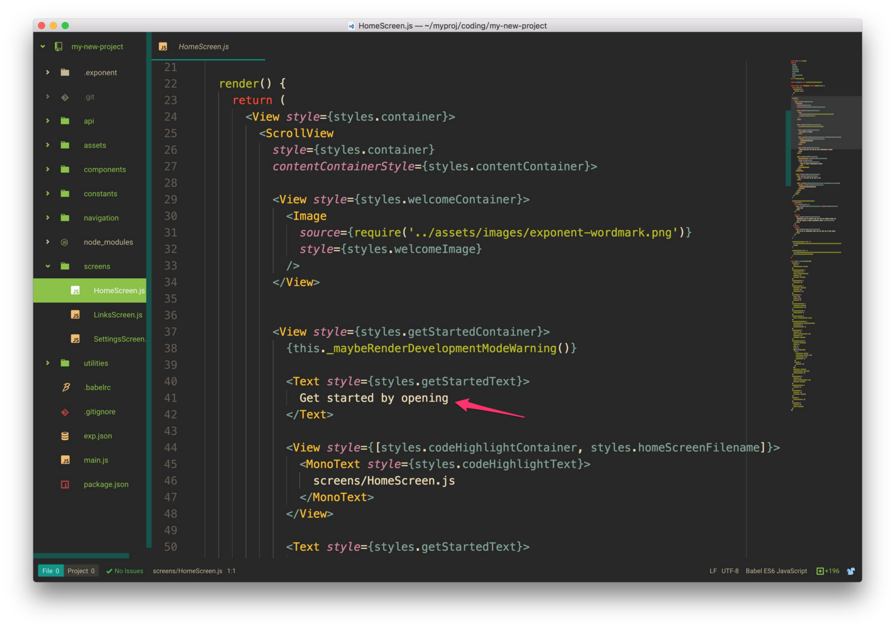
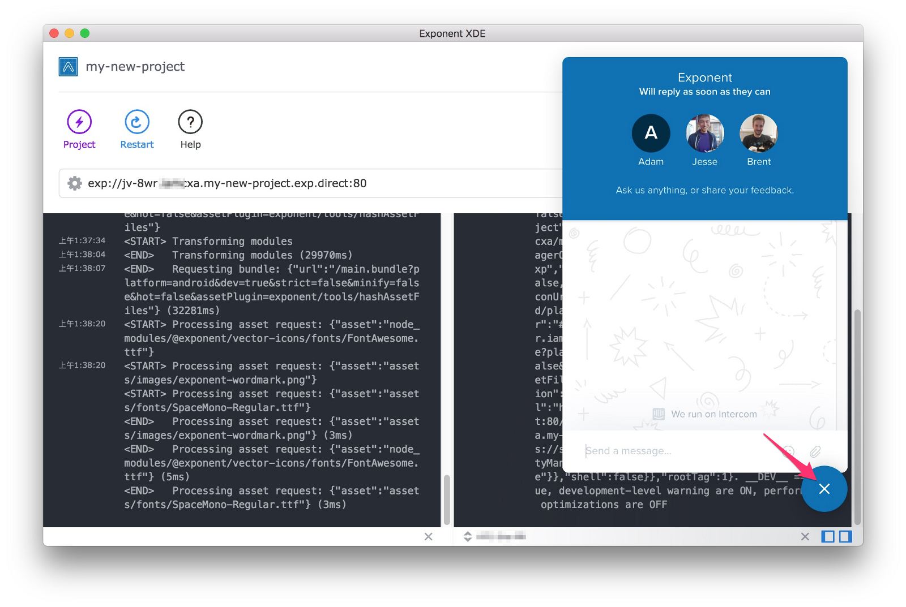

.. _up-and-running:

**************
Exponent：上手與執行
**************

第一篇指南的首要目標是盡快地建立並執行第一個 Exponent 應用程式。
在這個階段，我們應該要有一個已經安裝好 XDE 的環境，以及一組安裝有 Exponent 客戶端 app 的 iOS / Android 實體機或是虛擬機 / 模擬器。如果你仍有遺漏，請參照`Installation <../introduction/installation.html>`_章節。

建立帳號
"""""""""""""""""

初次執行 XDE 之後，你會看到一個詢問使用者名稱及密碼的提示。不要猶疑，請填上任何你想要的使用者名稱/密碼，然後按下繼續 — 如果該使用者名稱沒有重複，我們會自動為你建立該帳號。

建立專案
""""""""""""""""""""

按下 ``Project`` 並且選擇 ``New Project``，然後選擇 Tab Navigation 選項 — 這個樣板帶給我們一個好的開始 — 然後輸入你想要的專案名稱，以我來說，這將會是 ``my-new-project``。

.. figure:: img/exponent-new-project.png
  :width: 70%
  :alt: 建立專案

接下來，決定你的專案要存在哪裡。我個人會把所有我的酷玩意兒通通放在 ``/coding``，所以我選擇該路徑，並且按下打開。

XDE 現在會在你所選取的目錄初始化一個新專案，包含：一份複製過來的基本樣板，以及安裝 ``react``，``react-native`` 與 ``exponent``。

當專案初始化準備好之後，你會看到 XDE 的 Logs 視窗出現 ``React packager ready.`` 字句。這個 ``React packager`` 是一個簡單 HTTP Server，它使用 `Babel <https://babeljs.io/>`_ 替你編譯 app 所需要的 Javascript 程式碼，並且提供給你的 Exponent app 使用。

.. epigraph::
**NOTE**：如果你是 MacOS 的使用者，而且你的 XDE 卡在 “Waiting for packager and tunnel to start”，那你可能需要安裝 `install watchman on your machine <https://facebook.github.io/watchman/docs/install.html#build-install>`_。最簡單的安裝方式是透過 `Homebrew <http://brew.sh/>`_，執行這段指令：``brew install watchman``。

.. epigraph::
**NOTE2**：如果你先前就已經裝過 watchman < 4.6.0，那請使用這段指令更新：``brew uninstall watchman; brew install watchman``。

在你的手機或是模擬器上開啟 app
""""""""""""""""""""""""""""
你會在 XDE 上看到類似 ``exp://jv-8wr.iamcxa.my-new-project.exp.direct:80`` 般的網址，請把 ``exp`` 換成 ``http`` 後直接使用瀏覽器開啟它。
你將會看到一些 JSON 格式的內容。這個 JSON 就是 Exponent Manifest，它讓我們可以透過開啟 Exponent app 並且在 address bar 貼上該網址來開啟自己的 app。

或是試試另外一個很狂的方式：點選 ``Send Link``，輸入你的手機號碼（包含國碼如 +886912345678）或 Email，然後再次按下 ``Send Link``。
隨後點擊收到的簡訊中的連結，你的 app 就會透過 Exponent app 開啟。你可以分享這個連結給任何已經安裝 Exponent app 的朋友使用 — 但要注意的是，它將只在你的 XDE 正在執行中且有開啟對應專案時有效。
要在 iOS 模擬器中開啟 app，你可以點擊 Device 按鈕，然後選取 ``Open on iOS Simulator``（macOS 限定）。要在 Android 模擬器中開啟 app，你需要先啟動模擬器，再按下 ``Open on Android``。

作出你自己的變更
""""""""""""""

在你的專案中開啟 ``screens/HomeScreen.js``，然後修改 ``render()`` 函式中的任何文字字串。你應該會在你的 app 重新載入後看到你所做的變更。

.. _live-reload-help:
沒有變化嗎？
^^^^^^^^^^^^^^^^^^^^^^^
預設 ``Live reload`` 就是啟用的，但我們還是來看一次如何啟用的步驟吧！有時候事情就是不會隨著你所希望的那樣運作。
首先，確保 XDE 的 :ref:`development mode enabled in XDE <development-mode>` 已經啟用。
關閉 app 然後重新開啟。
當 app ㄧ經重啟，搖動你的裝置以開啟 ``Developer Menu``。如果你用的是模擬器，iOS 請按下 ``⌘+d``、Android 請按 ``Ctrl+M``。
如果你看到 ``Enable Live Reload``，你的 app 會在你按下它後隨即重啟。如果，你看到的是 ``Disable Live Reload``，那麼請離開 Developer Menu 然後試著做出其他變更。

.. figure:: img/developer-menu.png
  :width: 70%
  :alt: In-app developer menu

手動重新載入 app
------------

如果你已經按照以上的步驟嘗試過了，但是 Live reload 依然不能正常運作，那麼請按下 XDE 右下方的按鈕給我們發送一個支援請求。

在我們解決你的問題之前，你可以使用以下兩種方式來手動重新載入：
搖動你的裝置，然後按下 ``Reload。``
無論是否 development mode 都可以使用以下任一個方式重載：

.. figure:: img/exponent-refresh.png
  :width: 70%
  :alt: Refresh using Exponent buttons

恭喜！
-----

終於，你已經完成建立一個新的 Exponent 專案，同時做出程式碼變動、而且看見你的 app 動態更新。恭喜你！

下一步
-------

- :ref:`Additional Resources <additional-resources>` 頁面有收錄一些開源 Exponent 專案的連結，你可以過去逛逛並且試試看這些運作良好的範例。
- 閱讀 :ref:`Exponent SDK <exponent-sdk>` 文件，學習更多有用的 APIs。
- 閱讀本指南的其他章節。例如 :ref:`Push Notifications <push-notifications>`，以及我們如何替你管理 :ref:`Assets <all-about-assets>`，或是我們是如何建立你能夠發佈到 apple Store 或 Google Play 的 :ref:`Standalone Apps <building-standalone-apps>`。
- 加入我們的 Slack 以更快地取得回答！
